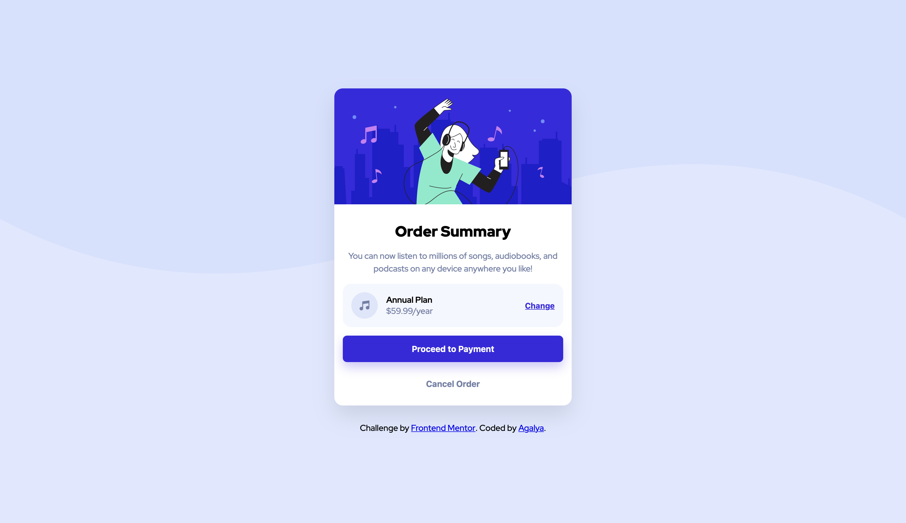

# Frontend Mentor - Order summary card solution

This is a solution to the [Order summary card challenge on Frontend Mentor](https://www.frontendmentor.io/challenges/order-summary-component-QpVjrRK6q). Frontend Mentor challenges help you improve your coding skills by building realistic projects.

## Table of contents

- [Overview](#overview)
- [The challenge](#the-challenge)
- [Screenshot](#screenshot)
- [Links](#links)
- [My process](#my-process)
- [Built with](#built-with)
- [What I learned](#what-i-learned)
- [Continued development](#continued-development)
- [Author](#author)

## Overview

### The challenge

Users should be able to:

- View the optimal layout for the component depending on their device's screen size
- See hover and active states for all interactive elements on the page

### Screenshot



### Links

- Solution URL: [GitHub Repo](https://github.com/Agalya141/Order_Summary_Component)
- Live Site URL: [Live Demo](https://agalya141.github.io/Order_Summary_Component/)

## My process

### Built with

- Semantic HTML5 markup
- CSS Custom Properties (Variables)
- Flexbox layout model
- Mobile-first/Responsive workflow
- Google Fonts integration (Red Hat Display)

### What I learned

This project focused on close pixel-matching against a design reference, and on how flexbox properties interact with each other in ways that aren't obvious until something breaks. Specifically, I practiced:

1. **`justify-content` vs. `align-items`:** Understanding that `justify-content` controls spacing along the main axis (row direction, by default) while `align-items` controls alignment along the cross axis — and that `justify-items` has no effect at all inside a flex container since it's a Grid-only property.
2. **`space-between` needs a sized container:** Discovered that `justify-content: space-between` only spreads elements correctly when the parent has an explicit `width: 100%`. Without it, `align-items: center` on the outer flex container lets the child shrink-wrap to its content, so `space-between` ends up working inside a much smaller box than expected.
3. **Background image sizing (`cover` vs. explicit sizing):** Learned that `background-size: cover` can crop important parts of a decorative SVG (like a wavy curve) if the SVG's aspect ratio doesn't match the viewport. Using an explicit `background-size` (or a real `` positioned absolutely) preserves the full shape instead of cropping it.
4. **Separate default and hover shadows:** Realized that a button can have a distinct `box-shadow` in its default state *and* a different, stronger one on `:hover` — the two aren't mutually exclusive, and the hover shadow should live inside the `:hover` selector, not the base rule.

```css
/* Example: default vs. hover shadow on the same button */
.proceed_button {
  box-shadow: 0 10px 20px rgba(0, 0, 0, 0.1);
}

.proceed_button:hover {
  opacity: 0.9;
  box-shadow: 0 10px 20px hsl(245, 75%, 52%, 0.4);
}
```

### Continued development

In future projects, I want to focus on:

- Setting `width: 100%` on flex containers by default whenever `justify-content: space-between` is used, so spacing behaves predictably from the start.
- Swapping between mobile and desktop background assets with a real `` tag positioned via CSS, rather than relying on `background-image` sizing tricks.
- Writing default and hover states together from the start, instead of adding hover styles as an afterthought.

## Author

- GitHub - [@Agalya141](https://github.com/Agalya141)
- Frontend Mentor - [@Agalya141](https://www.frontendmentor.io/profile/Agalya141)
- LinkedIn - [Agalya M](https://www.linkedin.com/in/agalya6)
